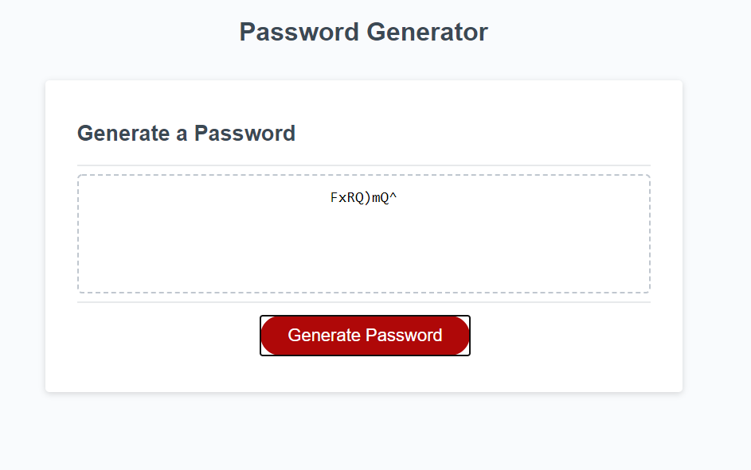

# pw_gen

## Random password generator application

### User Story

```
AS AN employee with access to sensitive data
I WANT to randomly generate a password that meets certain criteria
SO THAT I can create a strong password that provides greater security
```

### Acceptance Criteria

```
GIVEN I need a new, secure password
WHEN I click the button to generate a password
THEN I am presented with a series of prompts for password criteria
WHEN prompted for password criteria
THEN I select which criteria to include in the password
WHEN prompted for the length of the password
THEN I choose a length of at least 8 characters and no more than 128 characters
WHEN prompted for character types to include in the password
THEN I choose lowercase, uppercase, numeric, and/or special characters
WHEN I answer each prompt
THEN my input should be validated and at least one character type should be selected
WHEN all prompts are answered
THEN a password is generated that matches the selected criteria
WHEN the password is generated
THEN the password is either displayed in an alert or written to the page
```

### Features

- User is able to choose a password length between 8-128 characters
- User can choose all or a combination of the following: capital letters, lower case letters, numbers, symbols
- A random Password is chosen given the options selected
- The password is returned to the space provided so the user can quickly copy and paste it where they need to

### Screenshot of Work


### Deployed Page

https://peter-izzo.github.io/pw_gen/
